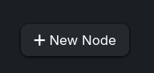
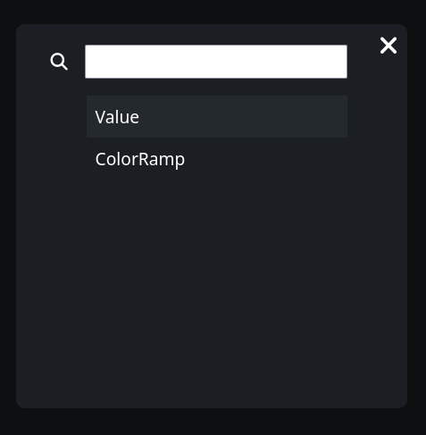
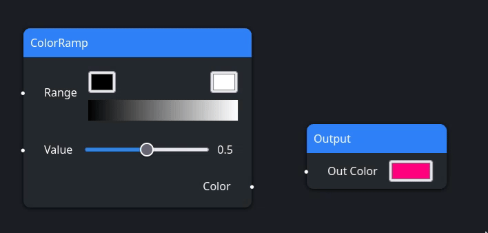

# Shader Editor

A website built from scratch that allows you to create your own shaders using
nodes.

> [!IMPORTANT]
> This project is still a work in progress and is not made to be a complete and
> usable shader editor.

## Shader edition

You can open the context menu by right clicking on the canvas.

This allows you to create new nodes at this location.

You can select the node to create by clicking on the available options. A search
bar is available at the top to help filter results.

You can link nodes with each other by dragging the associated value to the
wanted destination.

